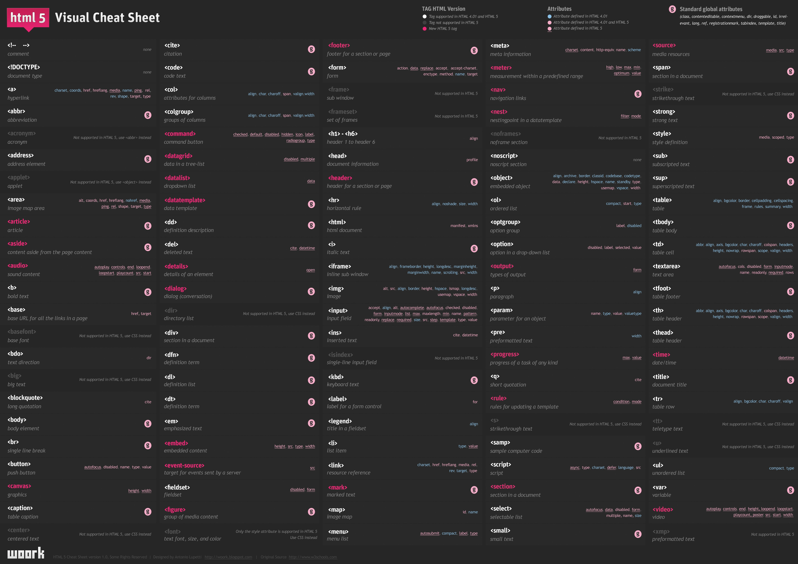
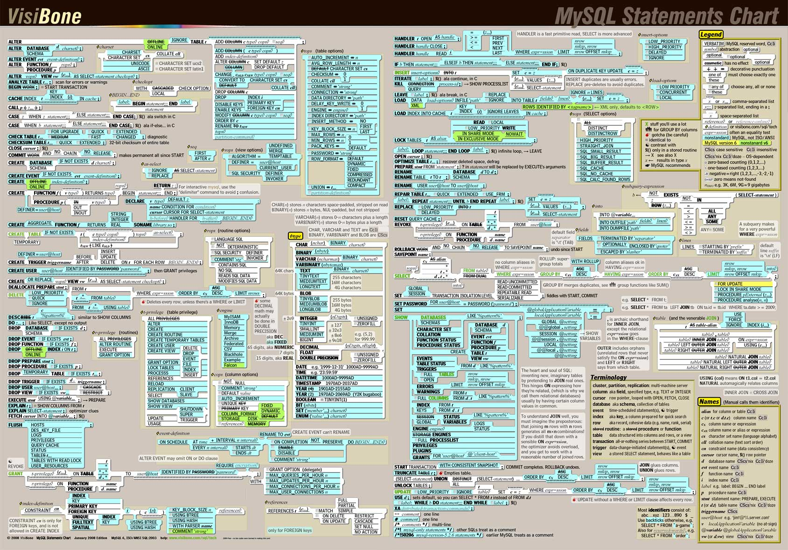
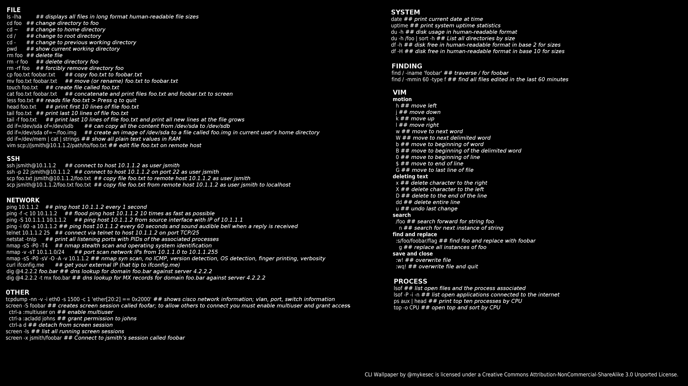
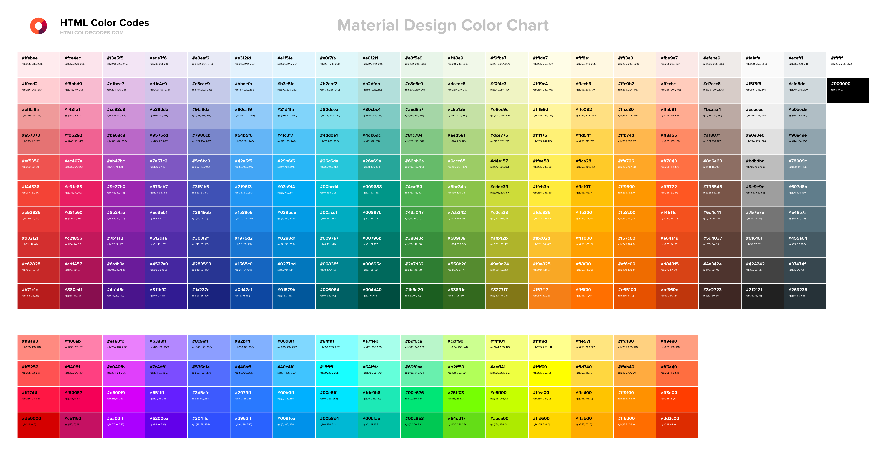
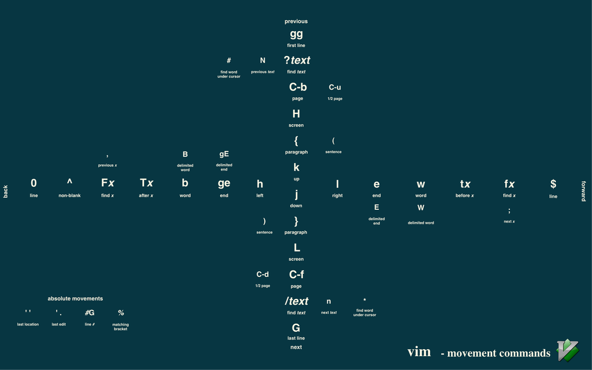
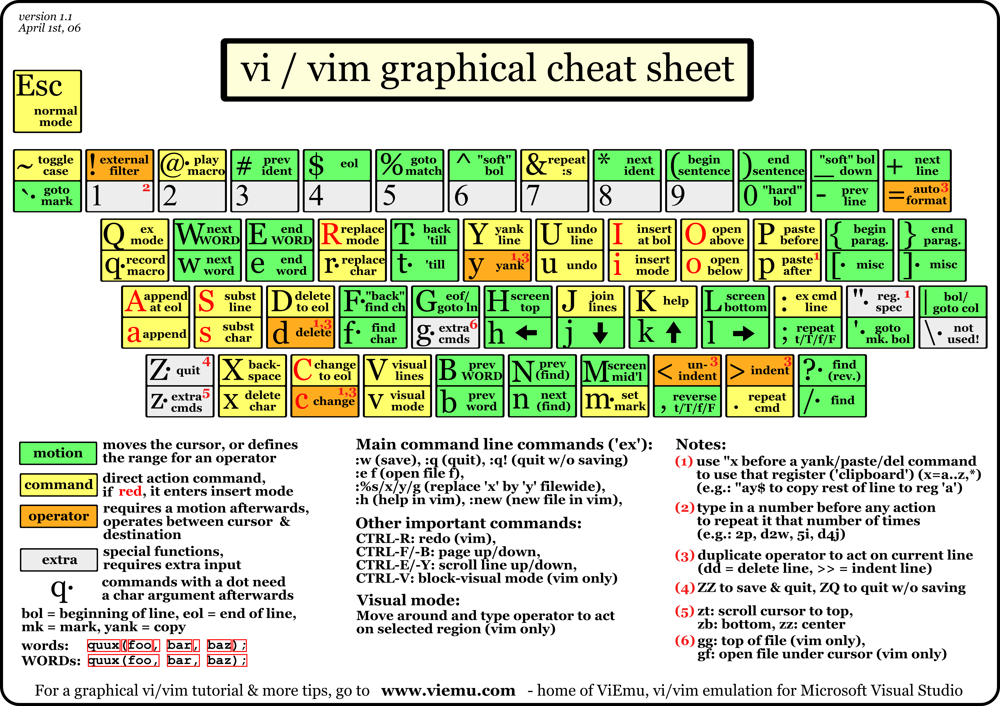

There is a #pre-commit git hook that looks like the following. It'll automatically add all the .png/.jpg files in the repo to the README for previewing. 

So all you've got to do to contribute is clone, add a picture, commit twice, and push! 

```
#!/bin/sh

# hooks are run from the root of the repository

# overwrite README with contributing instruction
cat CONTRIBUTING.md > README.md
# echo image names in markdown-rendery format to README
for file in *.jpg *.png; do 
    echo "" >> README.md
done
```











